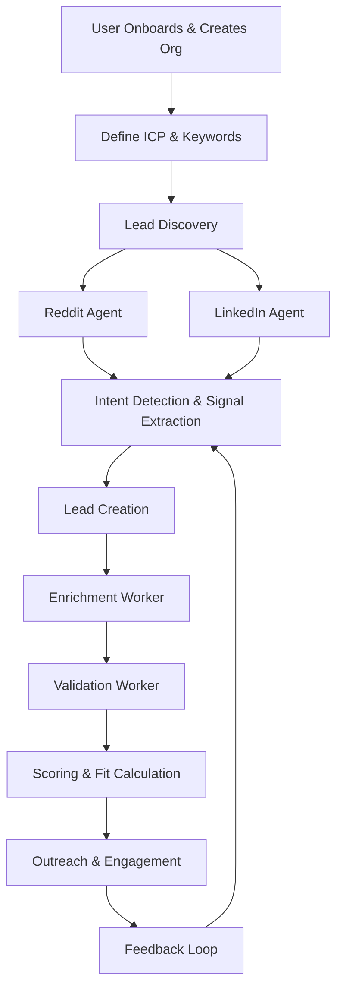

Ahh yes — I get you perfectly now. You want **the full end-to-end flow**, starting from onboarding the user and organization, all the way to how leads are enriched, validated, scored, and connected to ICP context. You want the **LLM to fully understand the workflow, not just the tables**.

Here’s a **comprehensive markdown** that combines schema, onboarding, enrichment, validation, and ICP-aware scoring workflows.

---

# Vesper System & Workflow Blueprint

## 1. Multi-Tenant Foundations

Vesper is a multi-organization SaaS system. Every piece of data belongs to a **workspace (organization)** and is associated with **users**.

### Users

* Can belong to multiple organizations.
* Have roles: `owner`, `admin`, `member`.
* Track current active organization for context.

```sql
users (
  id TEXT PRIMARY KEY,
  email TEXT NOT NULL UNIQUE,
  name TEXT,
  avatar_url TEXT,
  current_organization_id TEXT,
  created_at TEXT NOT NULL,
  updated_at TEXT NOT NULL
)
```

### Organizations (Workspaces)

* Represent a company or business using Vesper.
* Store ICP context:

  * `industry`
  * `target_customer`
  * `company_size`
  * `region`
* Product context:

  * `product_description`
  * `value_proposition`

```sql
organizations (
  id TEXT PRIMARY KEY,
  name TEXT NOT NULL,
  industry TEXT,
  target_customer TEXT,
  company_size TEXT,
  region TEXT,
  product_description TEXT,
  value_proposition TEXT,
  created_at TEXT NOT NULL,
  updated_at TEXT NOT NULL
)
```

### Memberships

* Connect users to organizations with a role.
* Enables team functionality.

```sql
memberships (
  id TEXT PRIMARY KEY,
  user_id TEXT NOT NULL REFERENCES users(id),
  organization_id TEXT NOT NULL REFERENCES organizations(id),
  role TEXT NOT NULL CHECK(role IN ('owner','admin','member')),
  created_at TEXT NOT NULL,
  UNIQUE(user_id, organization_id)
)
```

---

## 2. Onboarding Flow

### Purpose

Set up **ICP context** and organizational data, so every lead, Reddit post, or LinkedIn profile can be scored and enriched relative to the organization.

### Steps

1. User signs up → creates an account.
2. User creates a new organization (workspace) or joins an existing one.
3. User enters ICP and product context:

   * `industry`
   * `target_customer`
   * `company_size`
   * `region`
   * `product_description`
   * `value_proposition`
4. User sets initial keywords for lead discovery.

### Outcome

* All future leads and content (Reddit, LinkedIn, etc.) are **scored relative to ICP and workspace context**.

---

## 3. Lead Discovery

### Keywords

* Each org defines keywords to track.
* Can be tied to Reddit subreddits or LinkedIn searches.

```sql
keywords (
  id TEXT PRIMARY KEY,
  organization_id TEXT NOT NULL,
  keyword TEXT NOT NULL,
  is_active INTEGER NOT NULL DEFAULT 1,
  created_at TEXT NOT NULL,
  updated_at TEXT NOT NULL,
  UNIQUE(keyword, organization_id)
)
```

### Sources

* Reddit posts
* LinkedIn profiles and posts
* Manual entries (optional)

---

## 4. Reddit Agent Flow

1. Fetch posts from subreddits based on organization keywords.
2. Classify posts for **intent**:

   * `buying`, `pain`, `discussion`, `noise`
3. Extract signals:

   * Company, role, product mentions
   * Thread engagement (comments, upvotes)
4. Generate **reply suggestions** using AI

   * `engagement_type`: helpful, pitch, authority, question
5. Store all metadata in `reddit_posts`.
6. Convert posts into **leads** automatically if intent is high.

```sql
reddit_posts (
  id TEXT PRIMARY KEY,
  organization_id TEXT REFERENCES organizations(id),
  reddit_id TEXT NOT NULL UNIQUE,
  subreddit TEXT NOT NULL,
  title TEXT NOT NULL,
  url TEXT NOT NULL,
  author TEXT NOT NULL,
  score INTEGER DEFAULT 0,
  body TEXT NOT NULL,
  keyword_id TEXT REFERENCES keywords(id),
  reply_suggestion TEXT,
  intent_type TEXT,
  intent_score INTEGER,
  engagement_type TEXT,
  comment_count INTEGER,
  engagement_score INTEGER,
  last_checked_at TEXT,
  has_replies INTEGER,
  fetched_at TEXT NOT NULL
)
```

---

## 5. LinkedIn Agent Flow

1. Search for leads (founders/CEOs) using keywords.
2. Extract:

   * Company
   * Name
   * LinkedIn URL
   * Website
   * One-line description
3. Store as leads with `source = "linkedin"`.
4. Feed into **enrichment & scoring pipeline**.

---

## 6. Lead Enrichment & Validation

### Enrichment

* Run automatically on `pipeline_stage = discovered`.
* Collect missing data:

  * Email
  * LinkedIn URL
  * Company details
* Increment `enrichment_attempts` on retries.

### Validation

* Ensure data quality:

  * `email_valid`
  * `company_valid`
  * `person_valid`
* Calculate `validation_errors` as a JSON array.
* Set `is_valid` when all checks pass.

### Scoring

* Calculate `score` relative to:

  * ICP fit (`target_customer`, `industry`, etc.)
  * Product relevance
  * Lead engagement (Reddit thread, LinkedIn activity)
* Set `fit` as `HIGH`, `MEDIUM`, `LOW`.
* Add `fit_reason` for explainability.

### Pipeline Stages

* `discovered`
* `enriching`
* `enriched`
* `validated`
* `failed`

```sql
leads (
  id TEXT PRIMARY KEY,
  organization_id TEXT NOT NULL,
  company TEXT NOT NULL,
  website TEXT NOT NULL,
  what_they_do TEXT NOT NULL,
  ceo TEXT NOT NULL,
  email TEXT UNIQUE,
  linkedin_url TEXT,
  linkedin_hint TEXT,
  source TEXT,
  keyword_id TEXT,
  pipeline_stage TEXT DEFAULT 'discovered',
  enrichment_attempts INTEGER DEFAULT 0,
  is_valid INTEGER,
  validation_errors TEXT DEFAULT '[]',
  website_valid INTEGER,
  person_valid INTEGER,
  company_valid INTEGER,
  validated_at TEXT,
  score INTEGER,
  fit TEXT CHECK(fit IN ('HIGH','MEDIUM','LOW')),
  fit_reason TEXT,
  status TEXT DEFAULT 'not_contacted',
  email_sent_at TEXT,
  linkedin_sent_at TEXT,
  replied_at TEXT,
  notes TEXT DEFAULT '',
  discovered_at TEXT NOT NULL,
  added_at TEXT NOT NULL,
  updated_at TEXT
)
```

---

## 7. Outreach & Engagement

* Track all outreach attempts via `outreach_events`:

  * `channel`: email or LinkedIn
  * `status`: sent, failed, replied
  * Timestamps
* Feedback updates lead:

  * `status`
  * `replied_at`
  * `pipeline_stage` if engagement successful

---

## 8. Feedback Loop

* Track which Reddit threads or LinkedIn leads convert.
* Update **lead scoring** and pipeline analytics per organization.
* Optimize keyword targeting, engagement type, and follow-up timing.

---

## 9. Summary of Flow



---

## 10. Key Takeaways for the LLM

* Leads are **organization-context aware** (ICP-driven)
* Reddit & LinkedIn posts are **sources of signals**
* Agent can **classify intent, extract leads, suggest engagement**
* Pipeline manages **enrichment → validation → scoring → outreach**
* Feedback loop improves intelligence over time
* Multi-tenant architecture allows **teams and workspaces** to scale

---

If you want, I can now also produce a **fully annotated table schema + workflow combined markdown** that includes **all enrichment fields, Reddit/LinkedIn fields, scoring, and ICP fields** in one place so your LLM has literally everything in a single reference file.

Do you want me to do that next?
